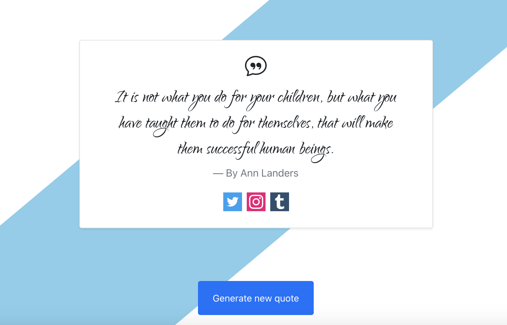

# FRONT END LIBRARIES PROJECT | RANDOM QUOTE MACHINE

> This is the first project of _freeCodeCamp "Front End Libraries Projects" Certification_

## HOW TO USE

### 1. Install all dependencies: 
```bash
$ npm install
```

### 2. Run the project in dev mode:
```bash
$ npm start
```

### 3. Open Browser
Open [http://localhost:3000](http://localhost:3000) with your browser to see the result.


## Technology Stack

- **ReactJS**: frontend library (set up with [create-react-app](https://github.com/facebook/create-react-app))
- **Bootstrap**: framework CSS
- **Bootstrap Icons**: official bootstrap icons library
- **SASS**: CSS pre-processors

## SUMMARY

You can use any mix of HTML, JavaScript, CSS, Bootstrap, SASS, React, Redux, and jQuery to complete this project. You should use a frontend framework (like React for example) because this section is about learning frontend frameworks. Happy coding!

### User Stories

| US | Description |
| :------------ | :----------- |
| **#1**: | I can see a wrapper element with a corresponding `id="quote-box"`. |
| **#2**: | Within `#quote-box`, I can see an element with a corresponding `id="text"`. |
| **#3**: | Within `#quote-box`, I can see an element with a corresponding `id="author"`. |
| **#4**: | Within `#quote-box`, I can see a clickable element with a corresponding `id="new-quote"`. |
| **#5**: | Within `#quote-box`, I can see a clickable a element with a corresponding `id="tweet-quote"`. |
| **#6**: | On first load, my quote machine displays a random quote in the element with `id="text"`. |
| **#7**: | On first load, my quote machine displays the random quote's author in the element with `id="author"`. |
| **#8**: | When the #new-quote button is clicked, my quote machine should fetch a new quote and display it in the #text element. |
| **#9**: | My quote machine should fetch the new quote's author when the `#new-quote` button is clicked and display it in the `#author` element. |
| **#10**: | I can tweet the current quote by clicking on the `#tweet-quote a` element. This `a` element should include the `"twitter.com/intent/tweet"` path in its href attribute to tweet the current quote. |
| **#11**: | The `#quote-box` wrapper element should be horizontally centered. Please run tests with browser's zoom level at 100% and page maximized. |